# Contract Sentinel — Architecture

**Status:** Living document · **Owner:** Tanmay Anand
**Scope:** End-to-end low-level architecture of Contract Sentinel — backend poll loop, contract drift engine, trace ingestion pipeline, hot cache, performance scraping, dependency graph, alert system, LLM agent reasoning, deterministic diagnosis orchestrator, frontend data layer, WebSocket event bus, and all cross-cutting infrastructure decisions.

---

## Table of Contents

1. [Design Principles](#1-design-principles)
2. [High-Level Architecture](#2-high-level-architecture)
3. [The Poll Cycle](#3-the-poll-cycle)
4. [Service Registry](#4-service-registry)
5. [Spec Snapshots](#5-spec-snapshots)
6. [Contract Drift Detection](#6-contract-drift-detection)
7. [Trace Ingestion Pipeline](#7-trace-ingestion-pipeline)
8. [Hot Cache (Write-Ahead Layer)](#8-hot-cache-write-ahead-layer)
9. [Performance and Metrics](#9-performance-and-metrics)
10. [Dependency Graph](#10-dependency-graph)
11. [Alert System](#11-alert-system)
12. [LLM Agent Subsystem](#12-llm-agent-subsystem)
13. [Frontend Architecture](#13-frontend-architecture)
14. [WebSocket Push Layer](#14-websocket-push-layer)
15. [Cross-Cutting Infrastructure](#15-cross-cutting-infrastructure)
16. [Database Schema](#16-database-schema)
17. [Tech Stack](#17-tech-stack)
18. [Configuration Reference](#18-configuration-reference)
19. [Invariants](#19-invariants)
20. [Open Decisions and Known Gaps](#20-open-decisions-and-known-gaps)

---

## 1. Design Principles

These are the non-negotiables the rest of the design serves.

1. **Pull, never push (for contracts).** CS fetches OpenAPI specs on a schedule rather than requiring services to register or emit events. A service needs zero CS-specific code — it only needs to expose `/v3/api-docs`.
2. **Oldest snapshot as the immutable baseline.** Drift is always compared against the *first-ever* known spec for a service, not the previous one. This means no breaking change is silently forgotten across restarts or re-polls.
3. **Deduplication at every boundary.** Hash-based dedup for snapshots; `(service, changeType, method, path)` dedup for drift events; `spanId`-based dedup for traces. The scheduler can repeat the same work safely.
4. **Write-ahead cache for hot reads.** Spans are written to both the in-memory hot cache and the database simultaneously. Recent queries hit the cache; the DB is the durable fallback. This keeps the UI reactive without hammering the database.
5. **Filter noise at the source.** CS's own polling calls (actuator, api-docs) are stripped from the trace store before `saveAll()` — they never touch the DB. A display-layer filter that runs after a DB read would still accumulate rows.
6. **LLM as analyst, not executor.** The agent loop calls LLM-backed tools against CS's own APIs and services. It never executes raw SQL or arbitrary code — every tool is a bounded call into an existing service method.
7. **Broadcast failures are swallowed.** WebSocket pushes are best-effort. A failed broadcast never propagates up to a DB write path and rolls back a transaction.

---

## 2. High-Level Architecture

Contract Sentinel is a single Spring Boot 4.0 application. All subsystems run in-process; PostgreSQL is the only external dependency at runtime.

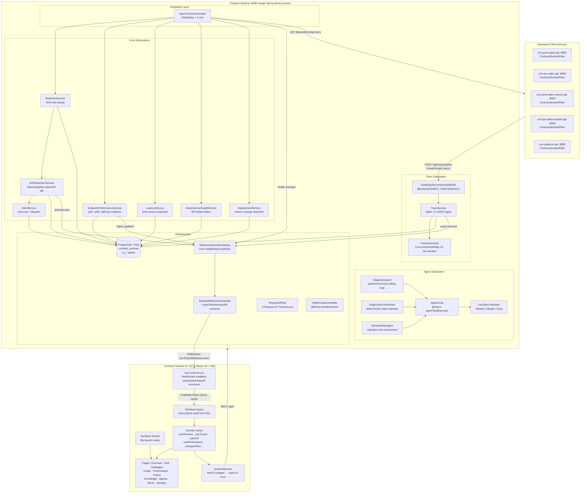

### Planes at a glance

| Plane | What lives here | Key classes |
|---|---|---|
| **Registry** | Master list of monitored services | `ServiceRegistry`, `ServiceRegistryServiceImpl` |
| **Poll loop** | Scheduled fetch + dispatch | `SpecFetcherScheduler` |
| **Snapshot** | Raw spec history + health | `SpecSnapshot`, `SpecSnapshotServiceImpl` |
| **Drift** | OpenAPI contract diff + events | `DriftDetectionServiceImpl`, `DriftEvent` |
| **Trace** | Zipkin-compatible ingestion + query | `TraceServiceImpl`, `TraceHotCache`, `TraceSpan` |
| **Performance** | Prometheus scrape → p50/p95/p99 | `EndpointPerformanceServiceImpl`, `HttpServerMetricsParser` |
| **Latency** | Per-service latency time-series | `LatencyServiceImpl`, `LatencyMetric` |
| **Graph** | Service dependency discovery + BFS | `DependencyGraphServiceImpl`, `ServiceDependency` |
| **Alert** | Rule evaluation + channel dispatch | `AlertService`, `AlertConfig`, `AlertEvent` |
| **Agent** | Autonomous LLM diagnostic loop | `AgentLoop`, `DiagnosisAgent`, `SchemaRiskAgent`, `DiagnosisOrchestrator` |
| **WebSocket** | Real-time push to frontend | `SentinelWebSocketHandler`, `WebSocketEventPublisher` |
| **Config** | Cross-cutting infrastructure | `GzipBodyDecompressingFilter`, `RequestContext`, `HttpExceptionHandler` |

---

## 3. The Poll Cycle

`SpecFetcherScheduler.pollAll()` is the single driver of the entire observation loop. It fires with `@Scheduled(fixedDelayString = "${sentinel.poll.interval-ms}")` — the next cycle starts after the previous one finishes, so polls never overlap regardless of how long they take.

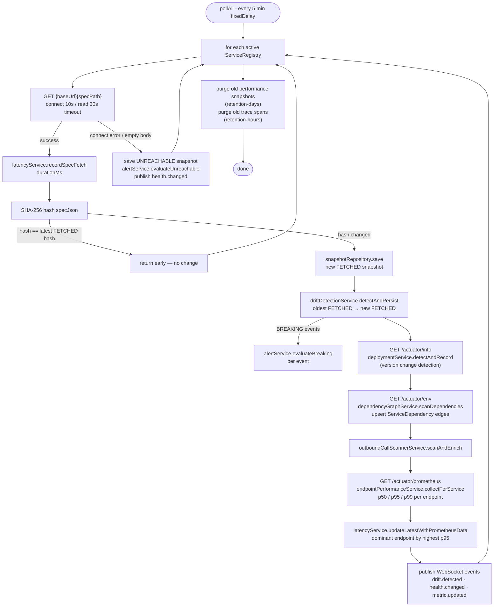

**Why `fixedDelay` over `fixedRate`:** `fixedRate` fires on a wall-clock interval regardless of the previous run's duration. If polling 10 services takes 6 minutes, you get overlapping polls. `fixedDelay` is safe for I/O-heavy schedulers — the next tick can't start before the previous one completes.

**`callCounter` telemetry:** Every outbound HTTP call increments `OutboundCallCounter` — spec polls, actuator metrics, actuator info, actuator env. The `/api/stats/call-count` endpoint exposes these for the infra view, so you can see exactly how many times CS has hit each actuator surface.

---

## 4. Service Registry

The registry is the master list of everything CS monitors. Every other subsystem — snapshots, drift, traces, performance — is keyed to a `ServiceRegistry` row.

**Entity: `cs_service_registry`**

| Column | Type | Notes |
|---|---|---|
| `id` | UUID (PK) | Generated |
| `name` | VARCHAR(100) UNIQUE | Human label, also used as `serviceName` in traces |
| `baseUrl` | VARCHAR(200) | e.g. `http://localhost:8081` |
| `specPath` | VARCHAR(100) | Default `/v3/api-docs` |
| `active` | BOOLEAN | Soft-delete; all queries use `findAllByActiveTrue()` |
| `createdAt` | TIMESTAMP | Immutable |

**Design decision — `active` over hard delete:** Deregistering a service preserves all its historical snapshots, drift events, and traces. Re-enabling it restores full history.

**DTO enrichment at query time:** `ServiceRegistryServiceImpl.findAll()` enriches each DTO with two derived fields via small targeted queries:
- `status` — derived from the most recent snapshot's `FetchStatus` (`FETCHED` / `UNREACHABLE` / `PARSE_FAILED`)
- `breakingDriftCount` — unacknowledged `BREAKING` drift events (`countByServiceAndSeverityAndAcknowledgedFalse`)

These are per-service queries rather than a single join to avoid N+1 and keep the mapping clean.

---

## 5. Spec Snapshots

Every spec fetch result (success or failure) is persisted as a `SpecSnapshot`. Snapshots are the raw historical record and the source of truth for both health status and drift comparisons.

**Entity: `cs_spec_snapshots`**

| Column | Type | Notes |
|---|---|---|
| `id` | UUID (PK) | |
| `service_id` | UUID (FK → registry) | |
| `specJson` | TEXT | Full OpenAPI JSON; null when UNREACHABLE |
| `specHash` | VARCHAR(64) | SHA-256 hex of specJson |
| `fetchedAt` | TIMESTAMP | |
| `fetchStatus` | ENUM | `FETCHED`, `UNREACHABLE`, `PARSE_FAILED` |
| `fetchDurationMs` | BIGINT | Round-trip latency to the service |

**Two critical repository queries:**

```
findTopByServiceAndFetchStatusOrderByFetchedAtDesc  → latest FETCHED (hash comparison source)
findTopByServiceAndFetchStatusOrderByFetchedAtAsc   → oldest FETCHED (immutable drift baseline)
```

**Why oldest-as-baseline:** If you compare consecutive snapshots, a field removed in snapshot 3 and re-added in snapshot 4 looks like no change by snapshot 4. Comparing against the oldest means that removal is permanently on record regardless of what happened later. This is the "oldest-baseline" invariant — the single most important correctness guarantee of the drift system.

**Manual re-detection:** `POST /api/snapshots/{serviceId}/redetect` triggers a fresh drift comparison between the oldest and newest snapshots without re-polling the service. Useful when a new `ChangeType` detector is added and you want to retroactively scan historical data.

---

## 6. Contract Drift Detection

After saving a new snapshot, the scheduler immediately calls `DriftDetectionServiceImpl.detectAndPersist(oldest, new)`. This is the core value proposition of CS — knowing *what* changed in an API contract, classified by severity.

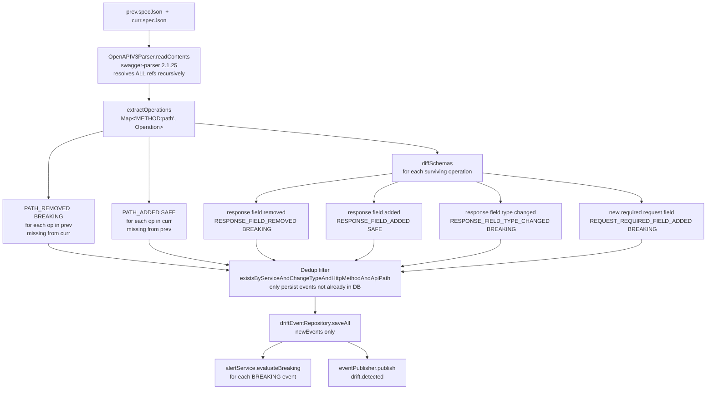

**Entity: `cs_drift_events`**

| Column | Type | Notes |
|---|---|---|
| `id` | UUID (PK) | |
| `service_id` | UUID (FK) | |
| `from_snapshot_id` | UUID (FK) | The oldest baseline |
| `to_snapshot_id` | UUID (FK) | The new snapshot |
| `detectedAt` | TIMESTAMP | |
| `changeType` | ENUM | `PATH_REMOVED`, `PATH_ADDED`, `RESPONSE_FIELD_REMOVED`, `RESPONSE_FIELD_ADDED`, `RESPONSE_FIELD_TYPE_CHANGED`, `REQUEST_REQUIRED_FIELD_ADDED` |
| `severity` | ENUM | `BREAKING` or `SAFE` |
| `httpMethod` | VARCHAR(10) | `GET`, `POST`, … |
| `apiPath` | VARCHAR(300) | e.g. `/api/bookings/{id}` |
| `detail` | TEXT | JSON blob with field name, old/new types |
| `acknowledged` | BOOLEAN | Operator-dismissable in the UI |

**Why swagger-parser over raw JSON diff:** OpenAPI specs use `$ref` pointers extensively. A JSON diff would see two identical `$ref` strings and conclude nothing changed, even if the referenced schema changed completely. `OpenAPIV3Parser` resolves all refs before comparison, so the diff operates on fully-expanded inline schemas.

**Dedup key:** `(service, changeType, httpMethod, apiPath)`. Prevents re-persisting the same logical change on every poll after it is first detected. If you add a new `ChangeType` enum value, dedup handles it automatically. If you *rename* an existing value, all existing events with that type lose dedup protection.

---

## 7. Trace Ingestion Pipeline

CS accepts Zipkin v2 JSON spans at `POST /api/traces/zipkin`. Each monitored service sends spans via its `ContractSentinelFilter` after every non-noise request.

### 7.1 ContractSentinelFilter (in each CRM service)

Spring Boot 4.0 removed Zipkin auto-configuration entirely — `management.zipkin.tracing.endpoint` is silently ignored. Each CRM service ships a `ContractSentinelFilter` (`OncePerRequestFilter`) that manually assembles and ships Zipkin v2 JSON.

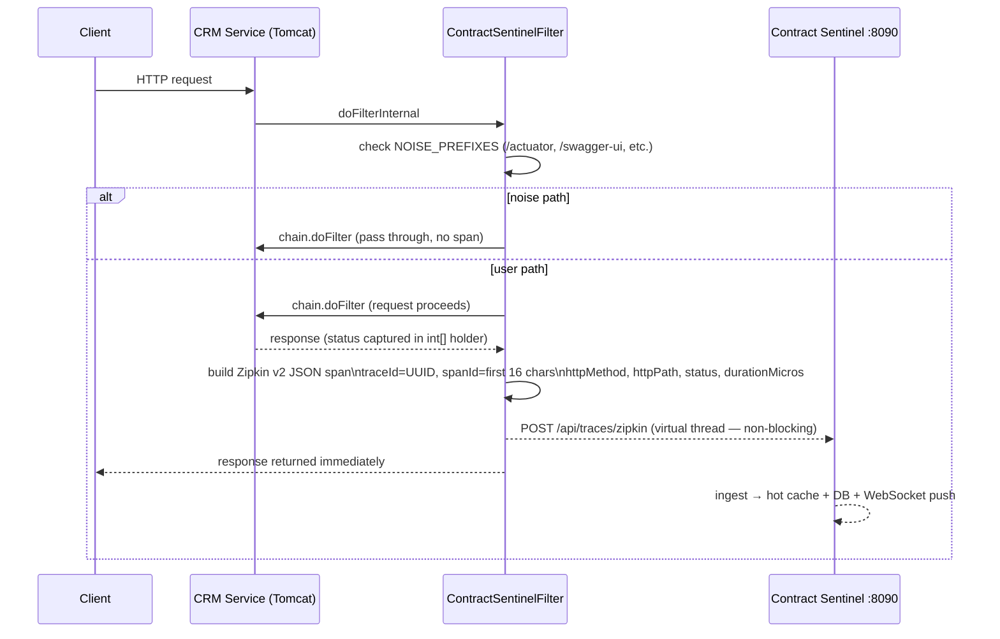

- **`@ConditionalOnProperty(name = "management.zipkin.tracing.endpoint")`** — filter only registers when the property is present. Harmless in staging/prod if absent.
- **`Executors.newVirtualThreadPerTaskExecutor()`** — span send is async; zero impact on request latency.
- **`log.debug`** for all send failures — never affects the request/response path.

### 7.2 Gzip decompression filter (on the CS side)

Spring Boot 4.0's `ZipkinHttpClientSender` gzip-compresses span batches above 1 KB and sets `Content-Encoding: gzip`. Tomcat does not automatically decompress gzip *request* bodies. Without intervention, Jackson receives raw gzip bytes and throws a 400.

`GzipBodyDecompressingFilter` runs at `@Order(HIGHEST_PRECEDENCE)` — before any Spring MVC processing. It decompresses the body with `GZIPInputStream` and wraps the request in a `GzipBodyRequestWrapper` that overrides `getInputStream()`, `getHeader("Content-Encoding")`, and `getContentLength()`. Downstream code sees plain JSON.

### 7.3 Two-pass ingest flow

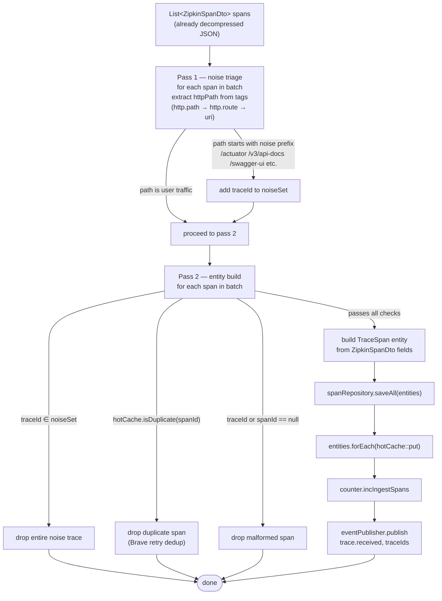

**Why two passes:** A single pass can't safely classify noise because the root span (which has the HTTP path tag) may not be first in the batch. Child spans of a noise trace would pass pass-1 filter individually. Pass 1 collects all noisy traceIds, pass 2 drops any span belonging to one of them.

### 7.4 ZipkinSpanDto → TraceSpan field mapping

| Zipkin field | TraceSpan column | Notes |
|---|---|---|
| `traceId` | `traceId` | 16 or 32 hex chars |
| `id` | `spanId` | 16 hex chars |
| `parentId` | `parentSpanId` | null for root spans |
| `localEndpoint.serviceName` | `serviceName` | Defaults to "unknown" |
| `name` | `spanName` | e.g. "POST /api/leads" |
| `kind` | `kind` | SERVER, CLIENT, PRODUCER, CONSUMER |
| `timestamp` | `startEpochMicros` | Microseconds since epoch |
| `duration` | `durationMicros` | |
| `tags["http.method"]` | `httpMethod` | Falls back to `tags["method"]` |
| `tags["http.path"]` | `httpPath` | Falls back to `http.route`, `uri` |
| `tags["http.status_code"]` | `httpStatus` | Parsed as Integer |
| `tags` (all) | `tagsJson` | Full tags as JSON blob |

### 7.5 `listTraces()` read strategy

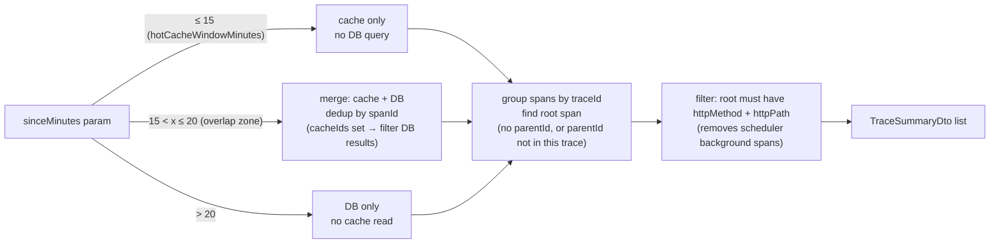

---

## 8. Hot Cache (Write-Ahead Layer)

`TraceHotCache` is an in-memory cache for recently ingested spans that enables near-instant reads without touching the database.

### 8.1 Internal structure

```java
ConcurrentHashMap<String traceId, ConcurrentLinkedQueue<TraceSpan>> spansByTrace
AtomicInteger totalSpans              // capacity guard (default 10,000)
LinkedHashSet<String> recentSpanIds  // LRU dedup set (max 1,000 entries)
Object dedupLock                     // guards recentSpanIds (not spansByTrace)
```

`ConcurrentHashMap` + `ConcurrentLinkedQueue` allow concurrent `put()` and `getSpansAfter()` from multiple HTTP threads without explicit locking on the data path. `LinkedHashSet` preserves insertion order so the oldest entry is always at `iterator().next()` — O(1) eviction of the LRU entry.

### 8.2 Eviction

Two independent triggers:

| Trigger | Mechanism |
|---|---|
| **Capacity** | If `totalSpans ≥ maxSpans`, evict the trace group whose head span has the oldest `receivedAt` before each `put()` |
| **Time** | Scheduler calls `evictBefore(cutoff)` each poll cycle, removing all spans older than `traceRetentionHours` |

### 8.3 Overlap-zone merge (sinceMinutes 15–20)

```java
Set<String> cacheIds = fromCache.stream().map(TraceSpan::getSpanId).collect(toSet());
fromDb.stream()
      .filter(s -> !cacheIds.contains(s.getSpanId()))   // DB-only spans
      .forEach(merged::add);
```

Prevents double-counting spans that exist in both locations (possible when a span was recently written to DB but the cache hasn't evicted it yet).

---

## 9. Performance and Metrics

Every poll cycle, CS scrapes `/actuator/prometheus` from each registered service and extracts per-endpoint latency percentiles.

### 9.1 `HttpServerMetricsParser` — line-by-line Prometheus parsing

The parser reads the raw Prometheus text format and accumulates per `(method, uri)` key:

| Prometheus line type | Matched by | Accumulated into |
|---|---|---|
| `http_server_requests_seconds_count{...}` | `isCount` | `acc.count += value`; `acc.errorCount` for CLIENT_ERROR/SERVER_ERROR outcome |
| `http_server_requests_seconds_sum{...}` | `isSum` | `acc.sumSeconds += value` |
| `http_server_requests_seconds_max{...}` | `isMax` | `acc.maxSeconds = max(existing, value)` |
| `http_server_requests_seconds{quantile="0.5",...}` | `isQuantile` | `acc.quantiles.merge("0.5", value, Math::max)` |
| `http_server_requests_seconds{quantile="0.95",...}` | `isQuantile` | `acc.quantiles.merge("0.95", value, Math::max)` |
| `http_server_requests_seconds{quantile="0.99",...}` | `isQuantile` | `acc.quantiles.merge("0.99", value, Math::max)` |

**Quantile resolution (per endpoint):**
- `p50` = `quantile["0.5"] * 1000` if present, else `(sumSeconds/count) * 1000`
- `p95` = `quantile["0.95"] * 1000` if present, **else `null`**
- `p99` = `quantile["0.99"] * 1000` if present, else `maxSeconds * 1000`

`p95` is only populated when the service exports `management.metrics.distribution.percentiles["[http.server.requests]"]: 0.5, 0.95, 0.99` in its `application.yaml`. Without this, the `quantile="0.95"` label never appears in Prometheus output.

**URI filter:** Paths are skipped if `uri == "UNKNOWN"`, `"None"`, `"/**"`, or start with `/actuator`, `/v3/api-docs`, `/swagger-ui`, `/swagger-resources`, `/webjars`, or equal `/scalar`.

### 9.2 Collection pipeline

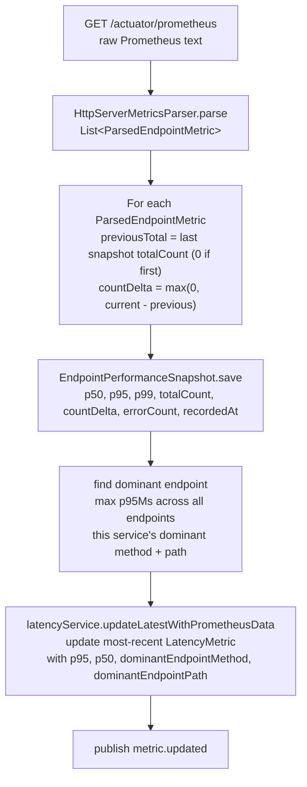

### 9.3 Volatility rating

`VolatilityCalculator.compute(List<Double> p95Series)` computes the coefficient of variation (CV = σ / μ) over the last 7 days of p95 samples per endpoint. CV is dimensionless — it makes volatility comparable across endpoints with different baseline latencies.

| CV range | Rating |
|---|---|
| `< 0.15` | `stable` |
| `0.15 – 0.40` | `variable` |
| `> 0.40` | `erratic` |

### 9.4 The latency rating badge (frontend + backend data join)

The Traces page and Overview page both show a Fast/Normal/Slow/— badge per trace:

```
durationMs < p50Ms          → "Fast"    (green)
durationMs < p50Ms × 2.5   → "Normal"  (amber)
otherwise                   → "Slow"    (red)
p50Ms == null               → "—"       (grey, no baseline yet)
```

`p50Map` is built in the frontend from `usePerformanceRegistry()` data, keyed by `"serviceName:METHOD:path"`. The `"—"` rating appears for newly connected services before enough Prometheus data has accumulated.

---

## 10. Dependency Graph

CS automatically discovers which services call which other services by inspecting their Spring environment properties, then models the result as a directed graph.

### 10.1 Discovery via `scanDependencies`

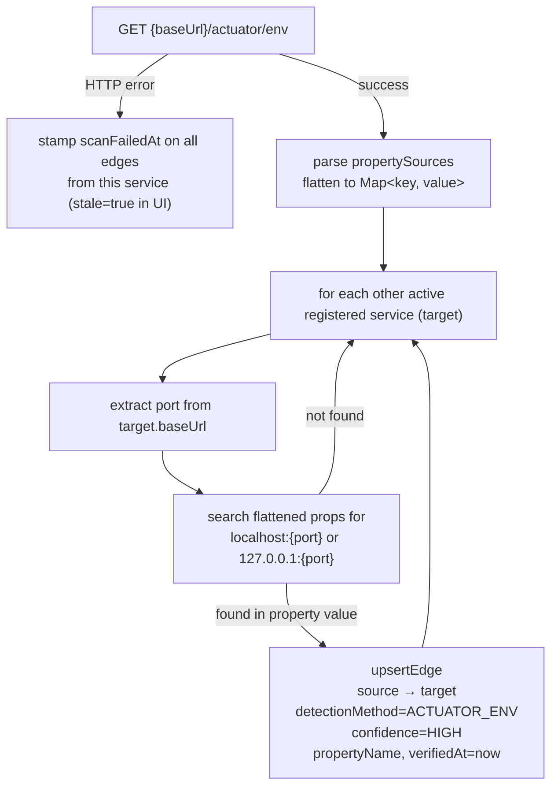

**Manual edges:** `POST /api/dependencies` accepts a `ManualDependencyRequest` (source, target, relationshipType, description) to record relationships that actuator env scanning can't discover (e.g., shared databases, webhooks, external APIs).

### 10.2 BFS blast-radius

```
getBlastRadius(serviceId) — "who would be affected if this service breaks?"

direct  = all services with an edge pointing TO the epicenter
visited = {epicenter}
queue   = direct.clone()

while queue not empty:
    current = queue.poll()
    for each service with edge → current (not yet in visited):
        transitive.add(service)
        visited.add(service)
        queue.add(service)

return { direct, transitive, total = |direct| + |transitive| }
```

**Entity: `cs_service_dependencies`**

| Column | Type | Notes |
|---|---|---|
| `source_service_id` | UUID (FK) | The caller |
| `target_service_id` | UUID (FK) | The callee |
| `detectionMethod` | ENUM | `ACTUATOR_ENV`, `MANUAL` |
| `confidence` | ENUM | `HIGH`, `MEDIUM`, `LOW` |
| `propertyName` | VARCHAR | Spring property that revealed the edge |
| `verifiedAt` | TIMESTAMP | Updated on each confirmed scan |
| `scanFailedAt` | TIMESTAMP | Set when env scan fails |
| `stale` | BOOLEAN (derived) | `scanFailedAt != null` |

---

## 11. Alert System

Alerts are evaluated lazily by the subsystem that detects the triggering condition — not by a separate polling loop.

### 11.1 Two trigger paths

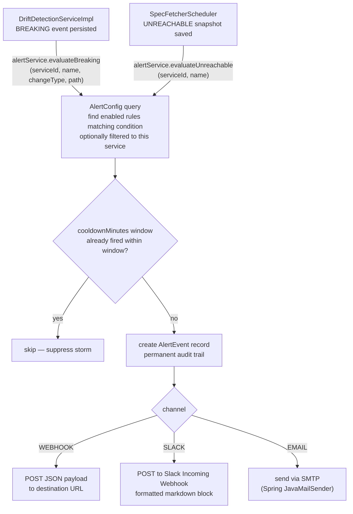

**`AlertConfig` fields:**

| Field | Type | Notes |
|---|---|---|
| `channel` | ENUM | `WEBHOOK`, `SLACK`, `EMAIL` |
| `destination` | VARCHAR(500) | URL or email address |
| `triggerOnBreaking` | BOOLEAN | Fire on BREAKING drift events |
| `triggerOnUnreachable` | BOOLEAN | Fire when service goes UNREACHABLE |
| `triggerOnSafe` | BOOLEAN | Fire on SAFE (informational) changes |
| `serviceFilter` | UUID (nullable) | Scope to one service; null = all |
| `cooldownMinutes` | INT | Default 30 — prevents alert storms |
| `enabled` | BOOLEAN | Toggle without deleting the rule |

---

## 12. LLM Agent Subsystem

The agent subsystem provides three agent types sharing one common loop implementation. All run asynchronously and stream steps to the frontend via polling.

### 12.1 The `AgentLoop` — autonomous tool-calling

`AgentLoop.run()` is decorated with `@Async("agentTaskExecutor")` — a dedicated bounded thread pool that prevents agent runs from blocking HTTP request threads.

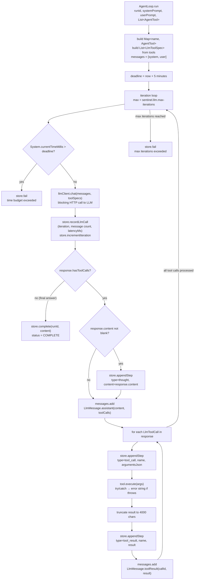

**Every step is persisted immediately** via `AgentRunStore` — not buffered until completion. This enables live streaming from the frontend's polling loop (`useAgentRun` polls every 1.5 s until `COMPLETE` or `FAILED`).

**Tool result truncation at 4,000 chars** prevents context exhaustion. A tool returning thousands of rows would push older messages out of the LLM's window, causing hallucination or failure.

### 12.2 DiagnosisAgent — autonomous performance diagnosis

`DiagnosisAgent` is the *autonomous* path: the LLM decides which tools to call and in what order, guided by a detailed system prompt that encodes the investigation playbook.

**System prompt playbook (embedded in class):**
1. Use `latency_trend` to confirm whether there is a regression (latest p95 vs baseline).
2. If regression detected, use `deployment_history` to see if a deploy lines up with it.
3. Use `usage_trend` to check whether the endpoint is being hit unusually often.
4. Infer likely SQL from the endpoint path; use `fk_lookup` / `row_count` to understand the tables; run `explain_query` with `EXPLAIN ANALYZE`.
5. Only if the query plan looks efficient, check `connection_pool`.

**Volatility mode:** When `mode = "VOLATILITY"`, a preamble is prepended to the system prompt that reframes the investigation from "why is this slow?" to "why is this *inconsistent*?" — directing the LLM toward cache misses, lock contention, and occasional expensive query paths.

**Tool set (for DiagnosisAgent):** All tools except `frontend_grep` (file system search is not relevant to latency diagnosis).

### 12.3 DiagnosisOrchestrator — deterministic structured diagnosis

Unlike `DiagnosisAgent`, the orchestrator follows a **fixed state machine** — the LLM is used only for the final narrative synthesis step.

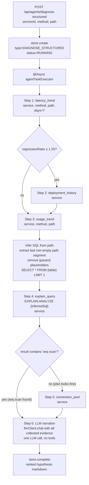

**Why two diagnosis modes?**
- `DiagnosisAgent` (autonomous) is more thorough — the LLM can deviate from the playbook if the data leads somewhere unexpected. More token-expensive and less predictable.
- `DiagnosisOrchestrator` (structured) is faster and cheaper — one LLM call at the end. The trade-off is that it can't adapt: it always runs all 5 steps in order, missing dynamic branches the autonomous agent might take.

### 12.4 SchemaRiskAgent

`SchemaRiskAgent` assesses the risk of a SQL migration statement before it runs.

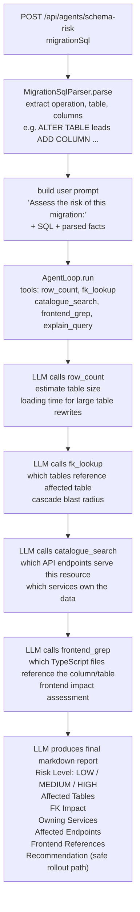

**System prompt sections the LLM is asked to fill:**
- Risk Level (LOW/MEDIUM/HIGH)
- Affected Tables & Row Counts
- FK Impact
- Owning Services
- Affected Endpoints
- Frontend References
- Recommendation (e.g. "add nullable → backfill → set NOT NULL")

### 12.5 Available tools

| Tool | Class | Wraps | Description |
|---|---|---|---|
| `latency_trend` | `LatencyTrendTool` | `EndpointPerformanceService` | Last N days of p50/p95/p99 snapshots for a specific endpoint. Returns regression ratio (latest p95 / first p95). |
| `usage_trend` | `UsageTrendTool` | `UsageAnalyticsService` | Request volume trend, dead endpoints for a service |
| `deployment_history` | `DeploymentHistoryTool` | `DeploymentService` | Recent deployments (version, timestamp) for a service |
| `row_count` | `RowCountTool` | `DbQueryService` | Approximate row count via `SELECT reltuples::bigint FROM pg_class` |
| `explain_query` | `ExplainQueryTool` | `DbQueryService` | `EXPLAIN ANALYZE` output for a SQL statement |
| `fk_lookup` | `FkLookupTool` | `SharedDbSchemaService` | FK relationships for a table — what references it and what it references |
| `frontend_grep` | `FrontendGrepTool` | File system grep | Search frontend `src/` for column or table name references in TypeScript files |
| `connection_pool` | `ConnectionPoolTool` | Actuator metrics | Current DB connection pool stats (`hikaricp.connections.*` Micrometer metrics) |
| `catalogue_search` | `CatalogueSearchTool` | `ApiCatalogueService` | Search registered endpoints by path fragment or method |

### 12.6 LLM provider abstraction

`LlmClient` is an interface with a single method: `LlmResponse chat(List<LlmMessage> messages, List<LlmToolSpec> tools)`. Three implementations:

| Provider | Class | Tool calling | Notes |
|---|---|---|---|
| **Ollama** | `OllamaClient` | Native (when `native-tools: true`) or manual JSON | Local, free, requires Ollama running on the machine |
| **Claude** (Anthropic) | `ClaudeClient` | Anthropic tool-use API (JSON schema) | `claude-sonnet-4-5` default; billed per token |
| **Groq** | `GroqClient` | OpenAI-compatible tool spec | `llama-3.3-70b-versatile` default; fast inference, billed |

`LlmConfig` selects the active implementation based on `sentinel.llm.provider`. All agent code depends only on `LlmClient` — no provider-specific imports escape the `llm` package.

**`LlmToolSpec` shape (passed to every provider):**
```json
{
  "name": "latency_trend",
  "description": "...",
  "parametersJsonSchema": {
    "type": "object",
    "properties": { "service": {"type": "string"}, "method": {"type": "string"}, ... },
    "required": ["service", "method", "path"]
  }
}
```

---

## 13. Frontend Architecture

The UI is a React 18 single-page application built with Vite. It follows a domain-driven folder structure and has two real-time data sources: REST (TanStack Query polling) and WebSocket (event invalidation).

### 13.1 Module structure

```
src/
├── main.tsx                              # QueryClient + Router bootstrap
├── index.css                             # Tailwind base + CSS variables (light/dark)
├── routeTree.gen.ts                      # Auto-generated by TanStack Router
├── routes/                               # File-based route definitions (thin shells)
│   ├── index.tsx                         → OverviewPage
│   ├── drift.tsx                         → DriftFeedPage
│   ├── catalogue.tsx                     → CataloguePage
│   ├── graph.tsx                         → GraphPage
│   ├── performance.tsx                   → PerformancePage
│   ├── infrastructure.tsx                → InfrastructurePage
│   ├── sampler.tsx                       → SamplerPage
│   ├── alerts.tsx                        → AlertsPage
│   ├── knowledge.tsx                     → KnowledgePage
│   └── services/$serviceId.tsx           → ServiceDetailPage
└── domains/contract-sentinel/
    ├── infrastructure/api/
    │   ├── sentinel.service.ts           # All API calls — single fetch() wrapper
    │   └── types.ts                      # All DTO types (mirrors backend DTOs)
    └── presentation/
        ├── components/                   # Shared visual components
        ├── hooks/                        # Data-fetching hooks (TanStack Query)
        └── pages/                        # Full-page components
```

### 13.2 Data flow — REST path

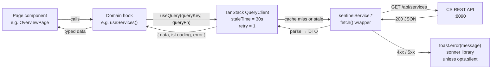

**`sentinelService`** is a plain object literal — no class, no DI. Every method calls the internal `request<T>(path, init?, opts?)` function which:
1. Calls `fetch(BASE_URL + path, ...)` (from `VITE_SENTINEL_API_URL` env or `http://localhost:8090`)
2. On non-OK: parses error body for `message` field, calls `toast.error()` (unless `opts.silent = true`), throws
3. On OK with body: returns `JSON.parse(text) as T`
4. On OK with empty body: returns `{} as T`

**`opts.silent`** suppresses the error toast for calls that are expected to fail in common scenarios (e.g. `graph.dbSchema` for a service whose DB isn't reachable).

### 13.3 Data flow — WebSocket real-time path

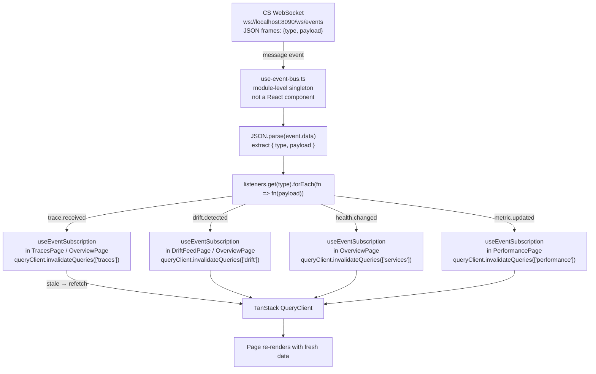

**`use-event-bus.ts` internals:**

```
listeners: Map<eventType, Set<Listener>>   — per-type subscriptions
stateListeners: Set<fn(ConnectionState)>   — connection status observers
socket: WebSocket | null                   — single connection per tab
backoffMs: 1000 (initial)                  — doubles on each close, capped at 30000
```

Key design decisions:
- **Module-level singleton** — not a React context or hook. The WebSocket connection is created once on the first `subscribe()` call and lives for the tab's lifetime. Multiple components subscribing to the same event type all share one socket.
- **Exponential backoff reconnect** — `scheduleReconnect()` doubles `backoffMs` each time (1s → 2s → 4s → … → 30s). Resets to 1s on successful `onopen`.
- **Stable callback ref** in `useEventSubscription` — `callbackRef.current = callback` on every render, but only one `subscribe()` call per mount. Prevents stale closure bugs without requiring `useCallback` at the call site.

### 13.4 Agent run polling

Agent runs are long-lived (seconds to minutes). The frontend polls the run endpoint until a terminal status is reached:

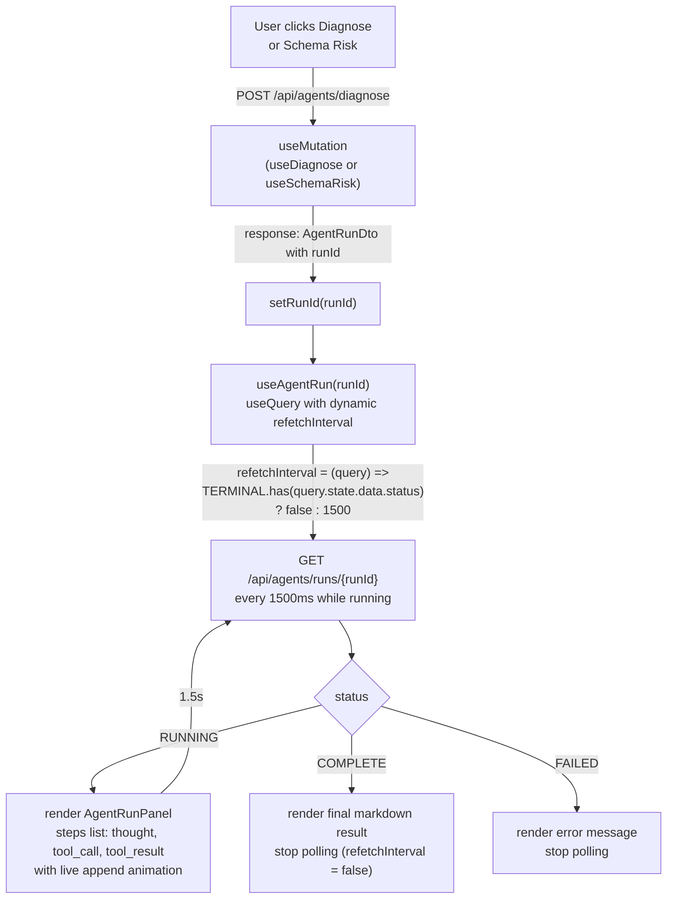

`TERMINAL = new Set(["COMPLETE", "FAILED"])` — once either is reached, `refetchInterval` returns `false` and TanStack Query stops auto-refetching.

### 13.5 Per-page data dependencies

| Page | Primary hooks | WS invalidation |
|---|---|---|
| **Overview** | `useServices`, `useLatency` (per service), `useTraces`, `usePerformanceRegistry`, `useDrift` | `services`, `traces`, `drift`, `performance` |
| **Drift Feed** | `useDrift`, `useServices` | `drift` |
| **Catalogue** | `useCatalogue` | — |
| **Graph** | `useGraph`, `useBlastRadius` | — |
| **Performance** | `usePerformanceRegistry`, `usePerformanceHistory` | `performance` |
| **Traces** | `useTraces`, `useTrace` (detail) | `traces` |
| **Alerts** | `useAlerts` | — |
| **Sampler** | `useSampler` | — |
| **Knowledge** | via `sentinelService.knowledge.*` | — |
| **Infrastructure** | `useInfrastructure` | — |
| **Service Detail** | `useSnapshots`, `useDeployments`, `useLatency`, `useDrift`, `useUsage` | — |

### 13.6 Health score computation (Overview page)

```typescript
function computeHealthScore(service: ServiceDto, allEvents: DriftEventDto[]): number {
  let score = 100
  score -= Math.min(service.breakingDriftCount * 20, 60)  // -20 per BREAKING, cap -60
  if (service.status === "UNREACHABLE" || service.status === "PARSE_FAILED") score -= 30
  const safeCount = allEvents.filter(
    e => e.serviceId === service.id && !e.acknowledged && e.severity === "SAFE"
  ).length
  score -= Math.min(safeCount * 3, 15)                    // -3 per SAFE, cap -15
  return Math.max(0, Math.min(100, score))
}
```

Score bands: `≥ 80` green, `60–79` amber, `< 60` red.

### 13.7 Latency card — sparkline + dominant endpoint

The service latency sparkline on the Overview page uses Recharts `AreaChart` to render `LatencyMetricDto[]` time-series. The tooltip shows `dominantEndpointMethod + dominantEndpointPath` — the endpoint with the **highest p95** at that time bucket, not the most recently called one.

The "Slowest endpoints" hover panel renders in document flow below the sparkline (not as an absolute overlay). This prevents Recharts' SVG layer from visually covering it via DOM stacking order.

---

## 14. WebSocket Push Layer

CS maintains persistent WebSocket connections to all open frontend tabs and pushes structured events whenever observable state changes.

### 14.1 Session management

`SentinelWebSocketHandler` extends `TextWebSocketHandler`:

```java
CopyOnWriteArraySet<WebSocketSession> sessions
```

`CopyOnWriteArraySet` is used because iteration (broadcast) happens far more often than mutation (connect/disconnect). Iteration reads a stable snapshot — thread-safe without a lock. Writes (connect/disconnect) copy the whole underlying array — O(n) but rare.

Each `sendMessage()` call is `synchronized(session)` — `WebSocketSession` is not thread-safe for concurrent writes. Without this lock, two simultaneous broadcasts to the same session produce garbled frames.

### 14.2 Event types

| Event type | Fired by | Frontend reaction |
|---|---|---|
| `connected` | On WS handshake (`afterConnectionEstablished`) | None (ack) |
| `trace.received` | `TraceServiceImpl.ingest()` after `saveAll()` | Invalidate `["traces"]` query |
| `drift.detected` | `DriftDetectionServiceImpl` after `saveAll()` | Invalidate `["drift"]` query |
| `health.changed` | `SpecFetcherScheduler` on status transition | Invalidate `["services"]` query |
| `metric.updated` | `EndpointPerformanceServiceImpl.collectForService()` | Invalidate `["performance"]` query |

### 14.3 Error isolation in `WebSocketEventPublisher`

```java
public void publish(String type, Object payload) {
    try {
        handler.broadcast(SentinelEvent.of(type, payload));
    } catch (Exception e) {
        log.warn("WebSocket broadcast suppressed for event '{}': {}", type, e.getMessage());
    }
}
```

All exceptions are swallowed. A broadcast failure must never propagate up to a DB write path (e.g. `TraceServiceImpl.ingest()`) and cause a transaction rollback that loses data. The frontend will catch up on its next regular poll.

---

## 15. Cross-Cutting Infrastructure

### 15.1 Request correlation ID

`RequestIdFilter` runs before all Spring MVC processing:
1. Reads `X-Request-ID` from the incoming request, or generates a UUID if absent.
2. Stores it in `RequestContext.setRequestId()` — a `static ThreadLocal<String>`.
3. Echoes it in the response via `X-Request-ID` header.
4. Clears it in a `finally` block to prevent ThreadLocal leaks across pooled threads.

All error responses include the request ID, making it straightforward to correlate a frontend error toast with a server log line.

### 15.2 Global exception handling

`HttpExceptionHandler` (`@RestControllerAdvice`) is the single location for all exception-to-HTTP translation. Controllers contain zero try/catch.

| Exception | Status | Notes |
|---|---|---|
| `SentinelException` | Varies | Domain exceptions carry their own status code |
| `MethodArgumentNotValidException` | 400 | Bean Validation failures; field errors joined into one message |
| `HandlerMethodValidationException` | 400 | `@Validated` constraint violations on method parameters |
| `HttpMessageNotReadableException` | 400 | Malformed request body (bad JSON, wrong type) |
| `MissingServletRequestParameterException` | 400 | Missing required query param |
| `MethodArgumentTypeMismatchException` | 400 | e.g. string where UUID expected |
| `IllegalArgumentException` / `IllegalStateException` | 400 | |
| `NoSuchElementException` / `NoResourceFoundException` | 404 | |
| `HttpRequestMethodNotSupportedException` | 405 | |
| `Exception` (catch-all) | 500 | Logs with full stack trace |

### 15.3 Pagination response wrapping

`PaginationResponseAdvice` (`@RestControllerAdvice` implementing `ResponseBodyAdvice<Page<?>>`) intercepts any controller return value that is a `Page<?>` and wraps it in `PaginatedResponse<T>` before serialisation. Controllers return `Page<T>` naturally; clients always receive the wrapped form with `content`, `totalElements`, `totalPages`, `number`. No controller wraps manually.

### 15.4 Jackson 3 (tools.jackson)

Spring Boot 4.0 bundles Jackson 3, which ships under the package `tools.jackson.*` (not `com.fasterxml.jackson.*`). All CS code uses `tools.jackson.databind.ObjectMapper`, `tools.jackson.databind.JsonNode`, etc. Mixing old Jackson 2 imports causes `NoClassDefFoundError` at runtime — both versions cannot coexist in the same classloader.

---

## 16. Database Schema

All tables are prefixed `cs_` to avoid collisions if CS is deployed alongside other services in the same PostgreSQL instance. `ddl-auto: update` applies schema changes automatically in dev and staging — schema changes are irreversible in production.

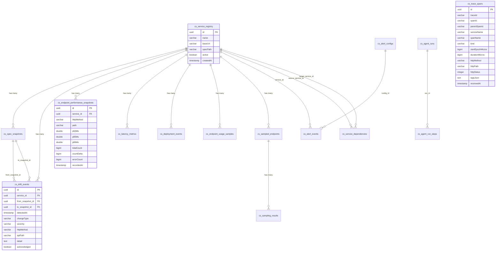

**Notable design decisions:**

- `cs_trace_spans` has **no FK to `cs_service_registry`** — `serviceName` is a plain string. CS doesn't require that a traced service be registered; `ContractSentinelFilter` in any service can push traces and they'll be accepted and stored. The trade-off is you can't join traces to registry data in SQL.
- `cs_spec_snapshots` accumulates indefinitely. Only the oldest and latest FETCHED matter for drift; everything in between is dead storage after detection. A retention job would need to exempt the oldest snapshot per service.

**Indexes of note:**
- `cs_trace_spans`: `idx_trace_spans_trace (traceId)`, `idx_trace_spans_received (receivedAt)` — the two most common query patterns.
- Consider compound `(service_id, recordedAt)` on `cs_endpoint_performance_snapshots` as data grows beyond ~1M rows.

---

## 17. Tech Stack

| Layer | Technology | Version | Notes |
|---|---|---|---|
| Language | Java | 21 | Virtual threads (`Executors.newVirtualThreadPerTaskExecutor()`) used for async span sends |
| Framework | Spring Boot | 4.0.1 | Spring MVC, Spring Data JPA, Spring WebSocket, Spring Scheduling |
| JSON | Jackson 3 (`tools.jackson`) | 3.0.3 | Bundled with SB4; package renamed from `com.fasterxml.jackson.*` |
| ORM | Spring Data JPA + Hibernate 7 | Boot-managed | All entities UUID PK, `ddl-auto: update` |
| Database | PostgreSQL | 17 | `cs_*` tables, `localhost:5402` dev, dedicated instance recommended in prod |
| OpenAPI parsing | swagger-parser | 2.1.25 | `OpenAPIV3Parser` resolves `$ref` before diff |
| WebSocket | Spring WebSocket (raw) | Boot-managed | Not STOMP; raw `TextWebSocketHandler` |
| HTTP client | Spring `RestClient` | Boot-managed | Used by scheduler for all outbound polls |
| API docs | springdoc-openapi | 3.0.1 | Swagger UI at `/swagger-ui.html` |
| Build | Maven | 3.x | No `mvnw` wrapper; use system `mvn` |
| Boilerplate | Lombok | Latest | `@Builder`, `@Getter`, `@Setter`, `@RequiredArgsConstructor` |
| **Frontend framework** | React | 18 | `StrictMode`, functional components only |
| **Routing** | TanStack Router | Latest | File-based, type-safe; `routeTree.gen.ts` auto-generated |
| **Server state** | TanStack Query | Latest | `staleTime=30s`, `retry=1`, per-hook invalidation on WS events |
| **Bundler** | Vite | Latest | `VITE_SENTINEL_API_URL` env for API base |
| **Styling** | Tailwind CSS + CSS variables | Latest | Light/dark via `@media prefers-color-scheme` + `:root[data-theme]` |
| **Charts** | Recharts | Latest | `AreaChart`, `ResponsiveContainer`; sparklines on Overview |
| **Graph rendering** | ELK.js (via React Flow) | Latest | Layered layout for dependency graph |
| **Notifications** | sonner | Latest | `toast.error()` on API failures |
| **Icons** | lucide-react | Latest | |
| **LLM (local)** | Ollama | — | `qwen2.5:14b` default; any model with tool-use support |
| **LLM (cloud)** | Anthropic Claude | — | `claude-sonnet-4-5` default; `SENTINEL_LLM_CLAUDE_API_KEY` |
| **LLM (cloud fast)** | Groq | — | `llama-3.3-70b-versatile`; `SENTINEL_LLM_GROQ_API_KEY` |

---

## 18. Configuration Reference

All CS-specific properties live under `sentinel.*` in `application.yaml`.

```yaml
sentinel:
  poll:
    interval-ms: 300000           # fixedDelay between poll cycles
    initial-delay-ms: 15000       # startup grace period before first poll

  traces:
    retention-hours: 24           # DB span retention
    hot-cache-window-minutes: 15  # spans younger than this served from cache only
    hot-cache-max-spans: 10000    # eviction cap (oldest trace group evicted)
    prod-batch-size: 50           # max traces returned per listTraces() call
    noise-path-prefixes:          # entire trace dropped at ingest if root path matches
      - /actuator
      - /v3/api-docs
      - /swagger-ui
      - /swagger-resources
      - /webjars
      - /scalar

  performance:
    retention-days: 30            # performance snapshot retention

  docker:
    enabled: true                 # docker ps integration for infra view

  gateway:
    url: http://localhost:8080    # gateway URL for health comparison

  frontend:
    source-dir: /path/to/ui/src  # FrontendGrepTool — absolute path to UI src/

  llm:
    provider: ollama              # ollama | claude | groq
    max-iterations: 10            # AgentLoop hard stop
    request-timeout-seconds: 120
    ollama:
      base-url: http://localhost:11434
      model: qwen2.5:14b
      native-tools: true          # false = manual JSON tool call parsing
    claude:
      base-url: https://api.anthropic.com
      model: claude-sonnet-4-5
      max-tokens: 2048
      api-key: ${SENTINEL_LLM_CLAUDE_API_KEY:}
    groq:
      model: llama-3.3-70b-versatile
      api-key: ${SENTINEL_LLM_GROQ_API_KEY:}
```

### Environment variable overrides

| Variable | Property overridden |
|---|---|
| `SENTINEL_DB_URL` | `spring.datasource.url` |
| `SENTINEL_LLM_PROVIDER` | `sentinel.llm.provider` |
| `SENTINEL_LLM_CLAUDE_API_KEY` | `sentinel.llm.claude.api-key` |
| `SENTINEL_LLM_CLAUDE_MODEL` | `sentinel.llm.claude.model` |
| `OLLAMA_BASE_URL` | `sentinel.llm.ollama.base-url` |
| `OLLAMA_MODEL` | `sentinel.llm.ollama.model` |
| `SENTINEL_FRONTEND_SOURCE_DIR` | `sentinel.frontend.source-dir` |

---

## 19. Invariants

These are invariants that must hold for the system to be correct. Violating any of them causes silent data corruption, cross-tenant data leaks, or incorrect drift results.

1. **The oldest FETCHED snapshot is never deleted.** Drift detection's correctness depends on the baseline surviving. If you add a snapshot retention job, exempt `findTopByServiceAndFetchStatusOrderByFetchedAtAsc` results — one row per active service.

2. **Drift dedup key is `(service, changeType, httpMethod, apiPath)`.** If you add a new `ChangeType` enum value, dedup handles it automatically. If you *rename* an existing value, all events with that type lose dedup protection and will be re-persisted on the next poll.

3. **Noise filter runs before `hotCache.isDuplicate()`.** The order matters — a span for a noise trace must be dropped before it can be recorded in the dedup set, or it would block a future real span with the same ID from being stored.

4. **WebSocket `broadcast()` is synchronized per session.** Do not remove this lock without understanding that `WebSocketSession.sendMessage()` is not thread-safe. Two simultaneous broadcasts to the same session without the lock produces garbled or dropped frames.

5. **`TraceHotCache` is not the source of truth.** Spans are written to DB first, then to cache. A restart loses the warm cache but not data. Any code path that reads from cache without a DB fallback for older data must respect the `hotCacheWindowMinutes` boundary.

6. **The poll cycle's `fixedDelay` must remain on `SpecFetcherScheduler.pollAll()`.** If changed to `fixedRate`, overlapping poll cycles become possible under slow service conditions. Each overlap duplicates outbound HTTP calls and can produce duplicate snapshots (caught by hash dedup but wasteful).

7. **Agent tools must never execute caller-controlled raw SQL.** Every tool that touches the database does so through `DbQueryService`, which uses parameterised JDBC queries. The `ExplainQueryTool` accepts a full SQL string (to run `EXPLAIN ANALYZE`) — this is intentional but must remain behind authentication if CS is ever exposed publicly.

---

## 20. Open Decisions and Known Gaps

1. **Snapshot retention** — snapshots accumulate indefinitely. Only the oldest and latest matter for drift; everything in between is dead storage. A retention job should keep `oldest FETCHED` + last-N + all `UNREACHABLE` records per service.

2. **`cs_trace_spans` has no service FK** — `serviceName` is a plain string, not a FK to `cs_service_registry`. Intentional (CS accepts traces from any service, registered or not), but means you can't join traces to registry data in SQL queries.

3. **No authentication** — CS has no login, session, or API key mechanism. Assumed to be deployed on a private network. Add Spring Security (HTTP Basic or JWT) if the deployment surface changes.

4. **Agent run cleanup** — `cs_agent_runs` records accumulate. No retention job or cleanup endpoint exists for completed/failed runs. Add a scheduled `deleteByCreatedAtBefore(Instant.now().minus(30, DAYS))`.

5. **`RestClient` for outbound polls has no connection pool** — `SpecFetcherScheduler` and `EndpointPerformanceServiceImpl` each create a `RestClient` with `SimpleClientHttpRequestFactory` (one connection per request). Under high service counts, switch to `HttpComponentsClientHttpRequestFactory` with a pool.

6. **Dedup set size fixed at 1,000 spanIds** — if a service emits more than 1,000 unique spans in a single batch (possible under load testing), the oldest dedup entries are evicted and a small number of spans could be double-processed. Make `DEDUP_MAX` configurable via `sentinel.traces.*`.

7. **`DiagnosisOrchestrator` SQL inference is naive** — `inferSql()` extracts the last non-empty path segment (minus `{param}` placeholders) and generates `SELECT * FROM {segment} LIMIT 1`. This is a best-effort heuristic that often works for simple REST resources but fails for nested paths like `/api/bookings/{id}/line-items` (infers `line-items`, not `booking_line_items`). A catalogue-lookup step before EXPLAIN would improve accuracy.

8. **No Prometheus percentile config enforcement** — if a CRM service's `application.yaml` is missing the `management.metrics.distribution.percentiles` block, `p95Ms` is always null in the performance registry. CS has no mechanism to detect or warn about this, so the UI silently shows `—` ratings indefinitely for that service.
