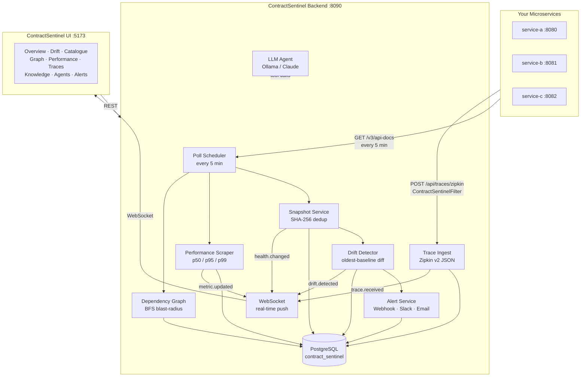
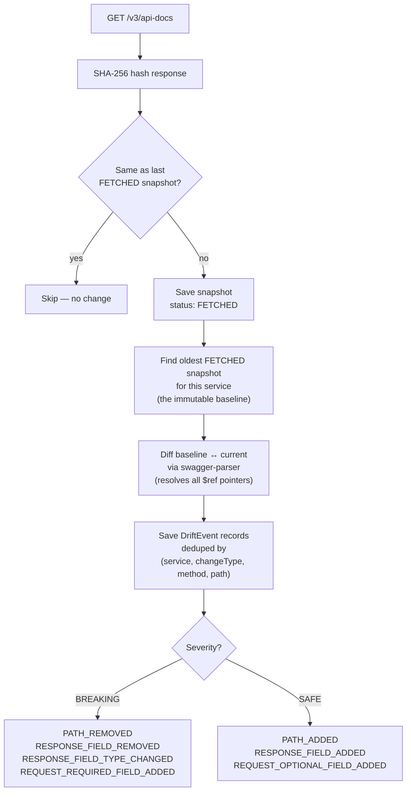

<p align="center">
  
</p>

<h1 align="center">ContractSentinel</h1>

<p align="center">
  Living API contract monitor for microservices — detect breaking changes before they reach production.
</p>

---

The problem you have right now: Suppose you have three services running. A field gets renamed in service 1, service 2 breaks, nobody finds out until a feature demo. You have no tester. You have Swagger docs but no enforcement.

**ContractSentinel** is a living API contract monitor that polls each of your microservices' OpenAPI specs, diffs them against their oldest-ever snapshot (the original contract), and classifies every change as breaking or safe — displayed on a real-time React dashboard.

---

## What It Does

- **Polls** each registered service's `/v3/api-docs` (or any OpenAPI endpoint) on a configurable schedule
- **Detects** what changed — path added/removed, response field added/removed, field type changed, required request field added
- **Classifies** every change as `BREAKING` or `SAFE` using oldest-baseline drift detection
- **Stores** a permanent snapshot and drift history in PostgreSQL (SHA-256 dedup — no duplicate snapshots)
- **Maps** your service dependency graph: shared databases, REST calls, webhooks, external APIs
- **Explores** your database schema: foreign key relationships, cross-service table dependencies
- **Queries** any monitored service's database in two modes: hand-written SQL or plain-English natural language (NL → Semantic IR → SQL → execute)
- **Tracks** latency, endpoint usage, response samples, and dead endpoints
- **Diagnoses** slow endpoints deterministically (latency regression → deployment correlation → usage trend → EXPLAIN → connection pool → LLM narration)
- **Analyses** schema changes with an AI agent (Claude or local Ollama) to assess migration risk
- **Maintains** a Knowledge Graph of domain term synonyms and pre-defined SQL metrics that improve natural-language query accuracy over time
- **Alerts** via configured channels when breaking changes are detected
- **Streams** live events to connected browser clients over WebSocket

---

## Feature Overview

| Feature | Description |
|---|---|
| **Contract Changes feed** | Real-time list of all breaking and safe changes with severity, affected endpoint, old/new value |
| **Impact panel** | Per drift event: which services call the affected endpoint (direct hit vs indirect dependency) |
| **Mark as reviewed** | Toggle "Mark it" / "Marked" per drift event — bidirectional acknowledge/unacknowledge |
| **Dependency graph** | ELK.js-powered layered graph: services as nodes, shared DBs / REST calls / webhooks as relay cards |
| **DB schema explorer** | Click any table → see it + 1-hop FK neighbors; progressive expand; cross-service FKs highlighted |
| **API Catalogue** | Browse every endpoint across all services with request/response schemas and latency pills |
| **Infrastructure view** | Container health, gateway routes, uptime |
| **Performance registry** | Per-endpoint p50/p95 latency scraped from Prometheus; sparklines and volatility over time |
| **Response sampler** | Configure and run live response samples; durationMs feeds latency pills when Prometheus has no data |
| **SQL query console** | Monaco editor with FK-aware graph visualisation, table browser, Ctrl+Enter to run |
| **NL query console** | Ask a plain-English question; ContractSentinel translates it to SQL via a typed Semantic IR and executes it |
| **Knowledge Graph** | Manage synonyms (NL terms → schema entities) and pre-defined SQL metrics; LLM-proposed entries await human approval |
| **Performance Diagnosis agent** | Tool-calling agent loop: latency regression → deployment correlation → usage trend → EXPLAIN → pool check → ranked hypotheses |
| **Structured Diagnosis** | Deterministic state machine version of the diagnosis: same 5 checks in a fixed order, LLM used only for final narration |
| **Schema Risk agent** | Analyses a migration SQL statement: row counts, FK impact, affected endpoints, rollout recommendation |
| **Agent provenance** | Every agent run records per-LLM-call timing and context size, visible in the run panel |
| **Alert channels** | Webhook / email alerts on breaking contract changes |
| **Real-time WebSocket** | Browser clients receive push events for drift detections and agent run updates without polling |

---

## Architecture



### Drift Detection Algorithm

ContractSentinel uses **oldest-baseline detection** — every diff is computed against the *first successful snapshot ever taken*, not the previous one. This means:

- Reverting a field to its original name removes the drift event
- A field that was added, removed, and re-added only shows as stable
- Services that were never reachable cannot produce false drift events



Unreachable services are stored as `UNREACHABLE` snapshots and are never used as a baseline — preventing false positives from transient downtime.

---

## Change Types

| Change Type | Severity |
|---|---|
| `PATH_REMOVED` | BREAKING |
| `RESPONSE_FIELD_REMOVED` | BREAKING |
| `RESPONSE_FIELD_TYPE_CHANGED` | BREAKING |
| `REQUEST_REQUIRED_FIELD_ADDED` | BREAKING |
| `PATH_ADDED` | SAFE |
| `RESPONSE_FIELD_ADDED` | SAFE |
| `REQUEST_OPTIONAL_FIELD_ADDED` | SAFE |

---

## Tech Stack

| Layer | Technology |
|---|---|
| Backend | Spring Boot 4.0.1, Java 21 |
| Database | PostgreSQL 17 |
| OpenAPI parsing | swagger-parser 2.1.25 |
| Frontend | React 19, TypeScript 5 |
| Routing | TanStack Router v1 |
| Data fetching | TanStack Query v5 |
| Styling | Tailwind CSS v4 |
| Graph layout | React Flow + ELK.js (Eclipse Layout Kernel) |
| SQL editor | Monaco Editor (`@monaco-editor/react`) |
| Charts | Recharts v3 |

---

## Project Structure

```
contract-sentinel/
├── backend/
│   ├── pom.xml
│   ├── docker-compose.yml          PostgreSQL 17 for local dev
│   └── src/main/
│       ├── java/io/contractsentinel/
│       │   ├── config/             SentinelProperties, CORS, request ID filter
│       │   ├── core/               Shared types (PaginatedResponse)
│       │   ├── exception/          SentinelException, HttpExceptionHandler
│       │   ├── seed/               DataSeeder (reads services from application.yaml)
│       │   ├── registry/           ServiceRegistry — register/list monitored services
│       │   ├── snapshot/           SpecSnapshot — fetch & store OpenAPI specs
│       │   ├── drift/              DriftEvent — detect & classify contract changes
│       │   ├── graph/              ServiceDependency — dependency graph, DB schema introspection
│       │   ├── query/              DbQuery — SQL console + NL query (SemanticQueryIR, IrToSqlCompiler, SemanticQueryValidator)
│       │   ├── knowledge/          Knowledge Graph — GraphSynonym, GraphMetric, approval workflow, LLM proposals
│       │   ├── catalogue/          ApiCatalogue — browse all endpoints
│       │   ├── sampler/            ResponseSampler — live samples + size/latency correlation
│       │   ├── latency/            LatencyMetric — per-endpoint latency history
│       │   ├── performance/        Endpoint performance registry + volatility scoring
│       │   ├── trace/              Zipkin span receiver + request-waterfall assembly
│       │   ├── profiling/          JFR hotspot profiler (async orchestration + .jfr parsing)
│       │   ├── llm/                Pluggable LLM client (Ollama / Claude)
│       │   ├── agent/              DiagnosisAgent, SchemaRiskAgent (tool-calling loop), DiagnosisOrchestrator (structured), provenance tracking
│       │   ├── usage/              EndpointUsage — dead endpoint detection
│       │   ├── deployment/         DeploymentEvent — deployment tracking
│       │   ├── alert/              AlertConfig — webhook/email alert channels
│       │   ├── infrastructure/     Container health, gateway routes
│       │   ├── stats/              OutboundCallCounter
│       │   └── ws/                 WebSocket config + event publisher (real-time push)
│       └── resources/
│           └── application.yaml    All configuration lives here
└── frontend/
    ├── index.html
    ├── package.json
    ├── vite.config.ts
    └── src/
        ├── domains/contract-sentinel/
        │   ├── infrastructure/api/ sentinel.service.ts, types.ts
        │   └── presentation/
        │       ├── components/     drift-event-row, dependency-card-node, db-schema-explorer,
        │       │                   query-console (SQL + NL modes), agent-run-panel (with provenance), …
        │       ├── hooks/          use-drift, use-graph, use-services, use-stats, use-agent-run, …
        │       └── pages/          graph-page, drift-feed-page, overview-page, performance-page, …
        └── routes/                 __root.tsx, TanStack Router file-based routes
            ├── index.tsx           Overview
            ├── drift.tsx           Contract Changes
            ├── catalogue.tsx       API Catalogue
            ├── performance.tsx     Performance Registry
            ├── traces.tsx          Request Waterfall
            ├── infrastructure.tsx  Infrastructure
            ├── graph.tsx           Dependency Graph + DB Schema + Query Console
            ├── knowledge.tsx       Knowledge Graph (synonyms, metrics, approval)
            └── alerts.tsx          Alert Channels
```

---

## Quick Start

### Prerequisites

- **Java 21** (e.g. via [SDKMAN](https://sdkman.io/): `sdk install java 21-tem`)
- **Maven 3.9+** (or use the included `./mvnw` wrapper)
- **Node.js 20+** and npm
- **Docker** (for the local PostgreSQL instance)

### 1. Start PostgreSQL

```bash
cd backend
docker-compose up -d
```

This starts PostgreSQL 17 on `localhost:5432`, database `contract_sentinel`, user `postgres`, password `password`.

### 2. Configure your services

Edit `backend/src/main/resources/application.yaml`:

```yaml
sentinel:
  services:
    - name: "user-service"
      baseUrl: "http://localhost:8080"
      specPath: "/v3/api-docs"          # optional — this is the default
    - name: "order-service"
      baseUrl: "http://localhost:8081"
      specPath: "/v3/api-docs"
```

Services listed here are seeded into the database on startup. Duplicates are skipped — safe to restart without re-seeding.

### 3. Run the backend

```bash
cd backend
./mvnw spring-boot:run
# Backend: http://localhost:8090
# Swagger UI: http://localhost:8090/swagger-ui.html
```

On first startup, the scheduler fires after 15 seconds and polls all configured services. Check the logs to confirm snapshots are being fetched.

### 4. Run the frontend

```bash
cd frontend
npm install
npm run dev
# UI: http://localhost:5173
```

If your backend runs on a different host or port, create `frontend/.env.local`:

```
VITE_SENTINEL_API_URL=http://your-host:8090
```

---

## Full Configuration Reference

All backend configuration lives in `backend/src/main/resources/application.yaml`:

```yaml
spring:
  datasource:
    url: ${SENTINEL_DB_URL:jdbc:postgresql://localhost:5432/contract_sentinel}
    username: postgres
    password: password             # change in production
  jpa:
    hibernate:
      ddl-auto: update             # auto-migrates schema on startup (dev/staging only)

server:
  port: 8090

sentinel:
  # How often to poll all services
  poll:
    interval-ms: 300000            # 5 minutes (in ms)
    initial-delay-ms: 15000        # grace period before first poll

  # Services to register and monitor (seeded once on startup)
  services:
    - name: "my-service"
      baseUrl: "http://localhost:8080"
      specPath: "/v3/api-docs"     # path to OpenAPI JSON spec

  # Manual service dependencies (edges in the dependency graph)
  # Use this for connections that cannot be auto-detected via actuator/env
  manual-dependencies:
    - source: "service-a"
      target: "service-b"
      propertyName: "shared-database"
      endpointCallsJson: null
    - source: "service-a"
      target: "service-c"
      propertyName: "internal-rest"
      endpointCallsJson: '[{"method":"GET","path":"/api/users/{id}"}]'

  # Docker integration (optional — for infrastructure view)
  docker:
    enabled: false                 # set true if Docker socket is accessible

  # API gateway integration (optional — for infrastructure view)
  gateway:
    url: ""                        # e.g. http://nginx:80

  # Database schema introspection (for DB schema explorer tab)
  db:
    schema: public                 # PostgreSQL schema to inspect

  # AI-powered features (diagnosis, schema risk, NL query, knowledge proposals)
  llm:
    provider: ${SENTINEL_LLM_PROVIDER:ollama}   # ollama | claude
    ollama:
      base-url: ${OLLAMA_BASE_URL:http://localhost:11434}
      model: ${OLLAMA_MODEL:qwen2.5:14b}
    claude:
      model: ${SENTINEL_LLM_CLAUDE_MODEL:claude-sonnet-4-5}
      api-key: ${SENTINEL_LLM_CLAUDE_API_KEY:}  # never commit a real key
```

**Environment variables summary:**

| Variable | Default | Purpose |
|---|---|---|
| `SENTINEL_DB_URL` | `jdbc:postgresql://localhost:5432/contract_sentinel` | Override the database JDBC URL |
| `SENTINEL_LLM_PROVIDER` | `ollama` | AI provider: `ollama` or `claude` |
| `OLLAMA_BASE_URL` | `http://localhost:11434` | Ollama server URL |
| `OLLAMA_MODEL` | `qwen2.5:14b` | Ollama model to use |
| `SENTINEL_LLM_CLAUDE_MODEL` | `claude-sonnet-4-5` | Claude model ID |
| `SENTINEL_LLM_CLAUDE_API_KEY` | _(empty)_ | Anthropic API key — set via env, never in yaml |

---

## API Endpoints

### Services

| Method | Path | Description |
|---|---|---|
| `GET` | `/api/services` | List all registered services with health status |
| `GET` | `/api/services/{id}` | Single service detail |
| `POST` | `/api/services` | Register a new service |
| `DELETE` | `/api/services/{id}` | Remove a service |
| `GET` | `/api/services/{id}/snapshots` | Snapshot history for a service |

### Drift Events

| Method | Path | Description |
|---|---|---|
| `GET` | `/api/drift` | All drift events (filter: `serviceId`, `severity`, `acknowledged`) |
| `GET` | `/api/drift/{id}` | Single drift event |
| `POST` | `/api/drift/{id}/acknowledge` | Mark a drift event as reviewed |
| `POST` | `/api/drift/{id}/unacknowledge` | Unmark a previously reviewed event |
| `GET` | `/api/drift/{id}/diff` | Full OpenAPI diff for a drift event |

### Polling

| Method | Path | Description |
|---|---|---|
| `POST` | `/api/poll/now` | Trigger immediate poll for all services |
| `POST` | `/api/poll/{serviceId}` | Trigger immediate poll for one service |

### Dependency Graph

| Method | Path | Description |
|---|---|---|
| `GET` | `/api/graph` | Full service dependency graph (nodes + edges) |
| `GET` | `/api/graph/blast-radius/{serviceId}` | Services that would break if this service changes |
| `GET` | `/api/graph/db-graph` | Full DB schema grouped by service |
| `POST` | `/api/dependencies` | Add a manual dependency edge |
| `DELETE` | `/api/dependencies/{id}` | Remove a dependency edge |
| `GET` | `/api/dependencies/{edgeId}/db-schema` | DB schema tables for a shared-DB edge |

### Database Query Console

| Method | Path | Description |
|---|---|---|
| `POST` | `/api/db/query` | Execute a read-only SELECT against a registered service's database |
| `POST` | `/api/db/nl-query` | Translate a natural-language question to SQL via Semantic Query IR and execute it |

`/api/db/query` body: `{ "serviceId": "<uuid>", "sql": "SELECT ..." }`
`/api/db/nl-query` body: `{ "serviceId": "<uuid>", "question": "How many orders were placed last week?" }`

NL query response includes `compiledSql`, `ir`, `columns`, `rows`, `rowCount`, `executionMs`, `llmAttempts`, and `synonymsApplied`.

### Knowledge Graph

| Method | Path | Description |
|---|---|---|
| `GET` | `/api/knowledge/graph` | Summary of approved/pending synonyms and metrics per service |
| `GET` | `/api/knowledge/synonyms` | List synonyms (filter: `approved`, `serviceName`) |
| `POST` | `/api/knowledge/synonyms` | Create a synonym manually (auto-approved) |
| `POST` | `/api/knowledge/synonyms/{id}/approve` | Approve an LLM-proposed synonym |
| `DELETE` | `/api/knowledge/synonyms/{id}` | Delete a synonym |
| `POST` | `/api/knowledge/synonyms/propose/{serviceId}` | Ask the LLM to propose synonyms for a service |
| `GET` | `/api/knowledge/metrics` | List pre-defined SQL metrics (filter: `approved`, `serviceName`) |
| `POST` | `/api/knowledge/metrics` | Create a metric manually (auto-approved) |
| `POST` | `/api/knowledge/metrics/{id}/approve` | Approve an LLM-proposed metric |
| `DELETE` | `/api/knowledge/metrics/{id}` | Delete a metric |
| `POST` | `/api/knowledge/metrics/propose/{serviceId}` | Ask the LLM to propose metrics for a service |
| `POST` | `/api/knowledge/resolve` | Resolve synonyms found in a text string |

### Catalogue, Latency, Usage

| Method | Path | Description |
|---|---|---|
| `GET` | `/api/catalogue` | All endpoints across all services |
| `GET` | `/api/services/{id}/latency` | Latency metrics for a service |
| `GET` | `/api/sampler/endpoints` | Configured response samplers |
| `GET` | `/api/services/{id}/usage/dead-endpoints` | Endpoints with zero observed traffic |

### Alerts

| Method | Path | Description |
|---|---|---|
| `GET` | `/api/alerts/configs` | List alert configurations |
| `POST` | `/api/alerts/configs` | Create an alert configuration (webhook/email) |
| `PUT` | `/api/alerts/configs/{id}` | Update an alert configuration |
| `DELETE` | `/api/alerts/configs/{id}` | Remove an alert configuration |
| `GET` | `/api/alerts/events` | List fired alert events |

### Performance, Profiling, Traces & Agents

| Method | Path | Description |
|---|---|---|
| `GET`  | `/api/performance/registry` | Latest reading per endpoint (filters: `serviceId`, `method`, `q`) |
| `GET`  | `/api/performance/history` | Full latency series for one endpoint (`serviceId`, `method`, `path`, `days`) |
| `POST` | `/api/profiling/{serviceId}/start` | Start a JFR recording (`durationSeconds`, 10–30) |
| `GET`  | `/api/profiling/runs/{runId}` | Poll a profiling run's status + hot methods |
| `GET`  | `/api/sampler/correlation/{endpointId}` | Payload-size vs response-time correlation |
| `POST` | `/api/traces/zipkin` | Zipkin v2 span ingest (services post here automatically) |
| `GET`  | `/api/traces` | Recent traces (filters: `serviceName`, `minDurationMs`, `sinceMinutes`) |
| `GET`  | `/api/traces/{traceId}` | Assembled trace waterfall |
| `POST` | `/api/agents/diagnose` | Start a performance-diagnosis agent run (LLM-driven tool-calling loop) |
| `POST` | `/api/agents/diagnose-structured` | Start a structured diagnosis (deterministic state machine; LLM for narration only) |
| `POST` | `/api/agents/schema-risk` | Start a schema-change risk assessment |
| `GET`  | `/api/agents/runs/{runId}` | Poll an agent run's live steps, result, and LLM provenance |

Full interactive docs: `http://localhost:8090/swagger-ui.html`

---

## Adding ContractSentinel to an Existing Project

ContractSentinel works as a **passive observer** — your services don't need to know about it. Requirements:

1. Your services expose an OpenAPI spec endpoint (Spring Boot's `springdoc-openapi` does this automatically at `/v3/api-docs`)
2. ContractSentinel can reach that endpoint over the network
3. Add an entry to `sentinel.services` in `application.yaml` for each service

For the dependency graph to show REST call edges automatically, your services should expose Spring Boot Actuator's `/actuator/env` endpoint — ContractSentinel scans it for URLs referencing other known services.

For manual dependencies (shared databases, webhooks, external APIs), add entries to `sentinel.manual-dependencies` in `application.yaml`.

---

## Dependency Graph

The **Graph** tab shows a layered ELK.js graph of your service dependencies:

- **Service nodes** — each registered service with its health status and drift count
- **Dependency relay nodes** — each edge between services becomes an intermediate node showing:
  - **Shared DB** — lists the shared tables with column counts
  - **Internal REST** — lists the specific endpoints being called (method + path)
  - **Webhook** — shows the webhook relationship
  - **External API** — shows the platform API dependency

Click any relay node to open a sidebar with full details. Click any service node to see its endpoints, drift count, and blast radius.

---

## Query Console

The **Graph → Query Console** tab supports two modes, switchable from the toolbar:

### SQL Mode

Hand-write SQL in the Monaco editor. Ctrl+Enter to run.

```
┌─────────────────────────────────────────────────────────────┐
│  [SQL] [Ask]  Target DB: [service ▼]  baseUrl   [▶ Run]    │
├──────────────┬──────────────────────────────────────────────┤
│  Table       │  Monaco Editor (SQL, Ctrl+Enter to run)      │
│  Browser     ├──────────────────────────────────────────────┤
│  (click to   │  ┌ Data results ┐ ┌ Graph results ┐  29 rows│
│   insert)    │  └─────────────────────────────────────────┘│
└──────────────┴──────────────────────────────────────────────┘
```

- **Table browser** — left panel lists all tables grouped by service. Click a table → inserts `SELECT * FROM table LIMIT 50`. Click a column → adds it to the SELECT list.
- **Resizable split** — drag the divider to adjust the editor/results ratio.

### Ask Mode (Natural Language)

Switch to **Ask** mode and type a plain-English question. ContractSentinel:

1. Resolves domain synonyms from the Knowledge Graph (e.g. "customer" → `buyer_id`)
2. Asks the LLM to fill a typed Semantic Query IR (intent, target table, filters, ordering, limit)
3. Validates the IR against the actual DB schema — feeds validation errors back to the LLM for repair (up to 3 attempts)
4. Compiles the IR to safe SQL via `IrToSqlCompiler`
5. Executes and returns results alongside the compiled SQL, synonyms applied, and LLM attempt count

The same Data and Graph result views work for both modes.

### Safety

All queries are validated before execution:

| Check | Behavior |
|---|---|
| Forbidden keywords (`INSERT`, `UPDATE`, `DELETE`, `DROP`, etc.) | Rejected — 400 with message |
| Multiple statements (`;` separator) | Rejected |
| Missing `LIMIT` | Auto-appended as `LIMIT 500` |
| `WITH ... SELECT` CTEs | Allowed |
| Max rows returned | Hard-capped at 500 in the service layer |

The console never writes to the database.

---

## Knowledge Graph

The **Knowledge** tab manages two types of domain knowledge that make natural-language queries more accurate:

### Synonyms

A synonym maps a natural-language term to a schema entity:

| Term | Target Type | Target Name | Service |
|---|---|---|---|
| customer | TABLE | buyers | order-service |
| total amount | COLUMN | amount_total | order-service |
| count | METRIC | total_order_count | — |

Synonyms can be created manually (auto-approved) or proposed by the LLM (pending human approval). The NL query pipeline applies only approved synonyms before sending the question to the LLM, reducing hallucination.

### Metrics

A metric is a reusable SQL snippet with a name, description, and anchor table:

```sql
-- name: total_order_count
SELECT COUNT(*) FROM orders
```

When the NL query IR identifies intent `METRIC` and a known metric name, `IrToSqlCompiler` returns the metric's SQL definition directly — no LLM compilation needed.

### Approval Workflow

LLM-proposed synonyms and metrics appear as **Pending** until a developer reviews and approves them. This prevents untrusted schema mappings from silently corrupting query results.

---

## Database Schema Explorer

The **Graph → Database Schema** tab gives you a focused exploration view:

1. **Left panel** — scrollable list of all tables, grouped by service, with search and filter (All / per-service / Cross-FK only)
2. **Right panel** — click any table to see it + its 1-hop FK neighbors via an ELK-powered mini graph
3. **Expand** — click `+` on any neighbor node to pin it and expand its own neighbors
4. **Cross-service FKs** — FK relationships that cross service boundaries are highlighted in amber

Every active service's database is introspected (via its `/actuator/env` datasource config), not just those linked by a `shared-database` edge. Databases are de-duplicated by JDBC URL, so services that genuinely share one physical database collapse into a single group.

---

## Performance Intelligence & AI Agents

ContractSentinel goes beyond contract validation into a full **performance intelligence stack**.

| Layer | What it tells you |
|---|---|
| **Payload vs Latency Correlation** | Spots N+1 candidates (exponential size→time growth) |
| **Endpoint Performance Registry** | Confirms which endpoints are worst, ranked relative to the fleet |
| **Endpoint Volatility Score** | Finds endpoints that are unpredictably bad (high coefficient of variation) |
| **Request Waterfall** | Shows where the time actually goes across services |
| **Inter-Service Network Latency** | Isolates whether it's the network or the receiving service |
| **JFR Hotspot Profiler** | Names the exact method the CPU is burning time in |

### Performance Registry & Volatility

Every poll, ContractSentinel scrapes each service's `/actuator/prometheus` and writes an `endpoint_performance_snapshots` row per observed endpoint (real p50/p95/p99, count delta, error count). The **Performance** tab renders one sortable row per endpoint with a 7-day p95 sparkline, a relative ranking badge ("8.4× median p99"), and a volatility rating (Stable / Moderate / Volatile / Erratic).

> Real percentiles require each service to publish them. Add to each monitored service's config:
> ```yaml
> management:
>   metrics:
>     distribution:
>       percentiles:
>         http.server.requests: 0.5, 0.95, 0.99
>   endpoints:
>     web:
>       exposure:
>         include: health, info, prometheus
> ```

### JFR Hotspot Profiler

Click **⚡ Profile** on any service card to run a 15–30s Java Flight Recorder session. ContractSentinel triggers it via a custom actuator endpoint, downloads the `.jfr`, parses `jdk.ExecutionSample` events, and surfaces the top hot methods by CPU sample share. Add this endpoint to each service you want to profile:

```java
@Component
@Endpoint(id = "jfr")
public class JfrProfilingEndpoint {
    private final AtomicReference<Recording> active = new AtomicReference<>();
    private volatile Path lastDump;

    @WriteOperation                 // POST /actuator/jfr {"durationSeconds": 20}
    public Map<String, Object> start(@Nullable Integer durationSeconds) {
        // new Recording(); enable("jdk.ExecutionSample").withPeriod(10ms);
        // setDuration(...); setDestination(temp); start(); ...
    }
    @ReadOperation                  // GET /actuator/jfr → {state, sizeBytes}
    public Map<String, Object> status() { /* ... */ }
    @ReadOperation                  // GET /actuator/jfr/download → {data: base64}
    public Map<String, Object> download(@Selector String action) { /* ... */ }
}
```

A complete, copy-paste implementation lives in `docs/JfrProfilingEndpoint.java`. Permit the POST in your security config: `.requestMatchers(HttpMethod.POST, "/actuator/jfr").permitAll()`.

### Request Waterfall & Inter-Service Latency

ContractSentinel accepts Zipkin v2 JSON spans at `POST /api/traces/zipkin`. Each service needs to send spans there after every request.

#### Spring Boot 3.x (micrometer auto-config)

Add the Brave bridge and reporter dependencies, then configure the endpoint:

```xml
<dependency><groupId>io.micrometer</groupId><artifactId>micrometer-tracing-bridge-brave</artifactId></dependency>
<dependency><groupId>io.zipkin.reporter2</groupId><artifactId>zipkin-reporter-brave</artifactId></dependency>
```
```yaml
management:
  tracing:
    sampling:
      probability: 1.0
  zipkin:
    tracing:
      endpoint: http://localhost:8090/api/traces/zipkin
```

#### Spring Boot 4.x — ContractSentinelFilter (required)

> **Spring Boot 4.0 removed all Zipkin auto-configuration** from `spring-boot-actuator-autoconfigure`. The `management.zipkin.tracing.endpoint` property is silently ignored. The micrometer dependency approach above does nothing on Spring Boot 4.

The fix is a lightweight `OncePerRequestFilter` that manually sends Zipkin v2 JSON spans — no new dependencies required:

```java
@Slf4j
@Component
@ConditionalOnProperty(name = "management.zipkin.tracing.endpoint")
public class ContractSentinelFilter extends OncePerRequestFilter {

    private static final List<String> NOISE_PREFIXES = List.of(
            "/actuator", "/v3/api-docs", "/swagger-ui", "/swagger-resources", "/webjars", "/scalar"
    );

    private final String zipkinEndpoint;
    private final String serviceName;
    private final ExecutorService executor = Executors.newVirtualThreadPerTaskExecutor();

    public ContractSentinelFilter(
            @Value("${management.zipkin.tracing.endpoint}") String zipkinEndpoint,
            @Value("${spring.application.name:unknown}") String serviceName) {
        this.zipkinEndpoint = zipkinEndpoint;
        this.serviceName = serviceName;
    }

    @Override
    protected void doFilterInternal(HttpServletRequest request, HttpServletResponse response,
                                    FilterChain chain) throws ServletException, IOException {
        String path = request.getServletPath();
        if (NOISE_PREFIXES.stream().anyMatch(path::startsWith)) {
            chain.doFilter(request, response);
            return;
        }
        long startMicros = System.currentTimeMillis() * 1000L;
        String traceId = UUID.randomUUID().toString().replace("-", "");
        String spanId  = traceId.substring(0, 16);
        int[] status   = {500};
        try {
            chain.doFilter(request, response);
            status[0] = response.getStatus();
        } finally {
            long durationMicros = System.currentTimeMillis() * 1000L - startMicros;
            executor.execute(() -> sendSpan(traceId, spanId, request.getMethod(),
                                            path, status[0], startMicros, durationMicros));
        }
    }

    private void sendSpan(String traceId, String spanId, String method, String path,
                          int status, long startMicros, long durationMicros) {
        try {
            String json = "[{\"traceId\":\"" + traceId + "\",\"id\":\"" + spanId
                    + "\",\"name\":\"" + method + " " + path
                    + "\",\"kind\":\"SERVER\",\"timestamp\":" + startMicros
                    + ",\"duration\":" + durationMicros
                    + ",\"localEndpoint\":{\"serviceName\":\"" + serviceName + "\"}"
                    + ",\"tags\":{\"http.method\":\"" + method
                    + "\",\"http.path\":\"" + path
                    + "\",\"http.status_code\":\"" + status + "\"}}]";
            HttpURLConnection conn = (HttpURLConnection) URI.create(zipkinEndpoint).toURL().openConnection();
            conn.setRequestMethod("POST");
            conn.setRequestProperty("Content-Type", "application/json");
            conn.setDoOutput(true);
            conn.setConnectTimeout(2000);
            conn.setReadTimeout(2000);
            try (var os = conn.getOutputStream()) { os.write(json.getBytes(StandardCharsets.UTF_8)); }
            conn.getResponseCode();
            conn.disconnect();
        } catch (Exception e) {
            log.debug("Failed to send trace to ContractSentinel: {}", e.getMessage());
        }
    }
}
```

Place the filter in your service's `config` package. Add the `management.zipkin.tracing.endpoint` property to `application.yaml`:

```yaml
management:
  zipkin:
    tracing:
      endpoint: http://localhost:8090/api/traces/zipkin
```

The filter activates only when that property is present (`@ConditionalOnProperty`), so removing it in staging/prod silently disables tracing with no code change. All failures are swallowed at `log.debug` — the request/response path is never affected. Spans are sent on a virtual thread (Java 21+) so there is zero blocking overhead.

The **Traces** tab lists collected traces and renders each as a waterfall. The dependency **Graph** edges are annotated with average inter-service round-trip latency (green &lt;10ms / amber 10–50ms / red &gt;50ms).

### AI Agents

Three agents investigate on your behalf. Each run records live steps as they execute and full LLM provenance (per-call timing, context size) visible in the agent run panel.

#### Performance Diagnosis (LLM-driven)

`POST /api/agents/diagnose` starts a tool-calling loop where the LLM decides which tool to call next based on previous results:

1. Fetch latency regression metrics
2. Correlate with recent deployments
3. Check usage trend
4. Run `EXPLAIN ANALYZE` on the inferred query
5. Check connection pool stats
6. Rank hypotheses and produce a narrated report

#### Structured Diagnosis (Deterministic)

`POST /api/agents/diagnose-structured` runs the same five checks in a **fixed, deterministic order** — no LLM involved in tool selection. The LLM is called exactly once at the end to narrate the collected evidence. This is faster, more predictable, and easier to reason about:

```
latency check → deployment correlation → usage trend → EXPLAIN → pool check → LLM narration
```

Each step is skipped with a structured reason if the data is unavailable (e.g. EXPLAIN skipped if no IR is available).

#### Schema Change Risk

`POST /api/agents/schema-risk` analyses a migration SQL statement: counts rows, maps FK relationships, finds affected endpoints and frontend references, and produces a risk report with a safe rollout recommendation.

### LLM Configuration

Both agents and the NL query pipeline use the same pluggable LLM client — **Ollama** (local, default) or **Claude** (opt-in):

```yaml
sentinel:
  llm:
    provider: ollama                      # or: claude
    ollama:
      base-url: http://localhost:11434
      model: qwen2.5:14b                  # a tool-capable model
    claude:
      api-key: ${SENTINEL_LLM_CLAUDE_API_KEY:}   # env only — never commit
```

> **Isolation note:** Using Ollama keeps all data fully local. Configuring the Claude provider sends prompts (including schema names, endpoint paths, and query questions) to Anthropic's API. Choose accordingly for sensitive environments.

---

## Real-Time WebSocket

ContractSentinel pushes events to connected browser clients over WebSocket at `ws://localhost:8090/ws`. The frontend connects automatically on load and receives:

- **Drift detected** — new breaking or safe change found during a poll
- **Agent run update** — step appended or run completed

This means the dashboard updates live without the user refreshing, and the agent run panel streams steps as they happen without explicit polling (the frontend falls back to 1.5s polling when WebSocket is unavailable).

---

## Production Notes

- Set `spring.jpa.hibernate.ddl-auto: validate` in production (not `update`)
- Use a connection pool (`spring.datasource.hikari.*`) sized for your load
- The poller runs on a single thread per service — for 50+ services consider increasing `poll.interval-ms`
- All outbound HTTP calls (spec fetching, actuator polling, response sampling) go through a tracked `RestTemplate` — the UI shows the total call count in the nav bar
- The NL query LLM call is synchronous on the request thread; for high query volume, front it with a queue or increase the async executor pool size

---

## License

MIT
